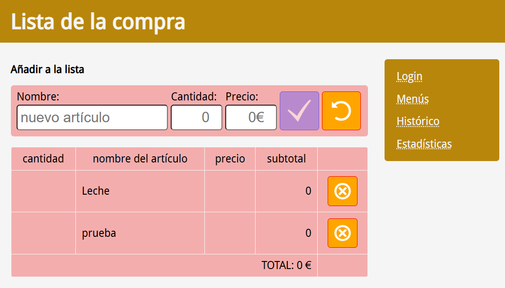
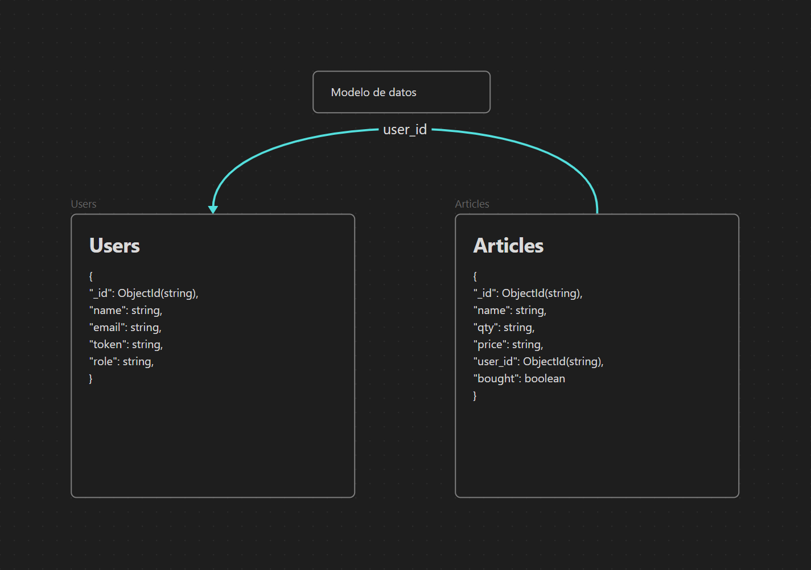

# Lista de la compra

[](https://app.netlify.com/sites/neoland-isorna/deploys)

Repositorio de Alvaro Isorna para el Bootcamp de Fullstack de Neoland.

## Descripción

La aplicación consiste en una lista de la compra compartida entre varios usuarios, gestionada gracias a una base de datos MongoDB ubicada en Mongo Atlas.

Puedes visitar la aplicación desplegada en: [Lista de la compra](https://neoland-isorna.netlify.app/)



El código front está compuesto de componentes web desarrollados con [Lit Element].

En este repositorio se aplican los conocimientos adquiridos durante el curso:

* HTML
* CSS (Responsive)
* JavaScript: programación funcional, principios de SOLID, patrones de diseño
* Lit Element como librería de componentes web
* Servidor de estáticos y APIs REST con ExpressJS
* Base de datos con MongoDB
* Habilitación como PWA para poder instalarla en dispositivos móviles.

...

## Dependencias de la aplicación

* Node >=20.0.0
* Express
* MongoDB

## Plugins de VS Code recomendados

* [ESLint](https://marketplace.visualstudio.com/items?itemName=dbaeumer.vscode-eslint)
* [Error Lens](https://marketplace.visualstudio.com/items?itemName=usernamehw.errorlens)

...

## Instalación y ejecución

```bash
npm install
```

Ejecutar en dos ventanas del terminal diferentes, el servidor de archivos estáticos y el servidor del backend.

```bash
npm run server:statics:start
npm run server:express:start
```

Una vez en ejecución, podemos acceder al front end de la aplicación en: [http://127.0.0.1:3333](http://localhost:3333), los endpoints de la API también se encuentran en el mismo puerto, gracias a [Express].

La configuración de los puertos está definida en el archivo .env, no incluído en el repositorio de git.

La aplicación usa REDUX para gestionar los datos en local, además de una copia en LocalStorage para agilizar el tratamiento de datos. También usa una simulación de OAuth para gestionar el login de usuario, almacenando la información del usuario identificado en SessionStorage, bloqueando el uso de los endpoints de escritura si el usuario no está identificado.

El registro de usuarios está bloqueado, para probarla usar el usuario de prueba: ```user: test``` y la contraseña: ```password: test```.

En lo relativo al interfaz, aplico estilos responsive para adaptar la vista al dispositivo, y uso tanto Flex como Grid para diferentes disposiciones de componentes.

Cada función/componente cumple con los estándares de SOLID.

También está implementada la validación de tipados por medio de JSDoc en los comentarios, y ESLint tanto en los Git Hooks como apoyo por medio del plugin de VS Code.

## Documentación

Para generar la documentación de la aplicación se usa [JSDoc] y se guarda en la carpeta ```out```. Para verla puedes ejecutar el comando ```npm run build:docs```.

## Modelo de datos y relaciones entre componentes



Explicar el tipado de datos con JSDoc y la validación con [ESLint] y los hooks de Git.

### pre-commit

Integramos [lint-staged] para ejecutar las validaciones antes de  ejecutar el commit.

```bash
#!/usr/bin/env sh

echo PRE-COMMIT GIT HOOK
npx lint-staged
```

### pre-push

Integramos el testeo unitario con [Jest] antes de ejecutar el push.

```bash
#!/usr/bin/env sh

echo PRE-PUSH GIT HOOK
npm run test
```

[JSDoc]: https://jsdoc.app
[Lit Element]: https://lit.dev
[ESLint]: https://eslint.org
[Express]: https://expressjs.com
[lint-staged]: https://github.com/lint-staged/lint-staged#readme
[Jest]: https://jestjs.io
